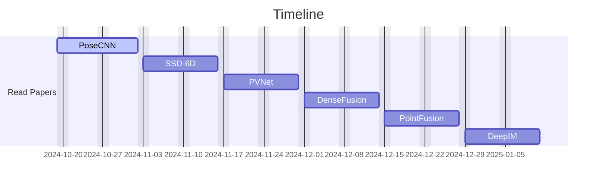

# 6D Pose Estimation Study

 

 

## Introduction

6D pose estimation is crucial in robotics and computer vision because it allows robots to understand the position and orientation (pose) of objects in a 3D space, which is essential for tasks like manipulation, navigation, and interaction with the physical world. Accurate 6D pose estimation enables robots to perform complex operations such as grasping objects, assembling parts, and navigating dynamic environments.

This study aims to first explore and understand the foundational research papers that serve as the basis for 6D pose estimation techniques. Following that, we will focus on creating a custom dataset tailored to specific use cases, and ultimately apply state-of-the-art 6D pose estimation methods on this dataset.

The overall goal is to solidify the theoretical understanding and then gain hands-on experience by implementing and optimizing 6D pose estimation for real-world applications.

 

## Team Members

|  |  |  |  |  |  |
|:----------------------------------------------------------:|:----------------------------------------------------------:|:----------------------------------------------------------:|:----------------------------------------------------------:|:----------------------------------------------------------:|:----------------------------------------------------------:|
| **동준**                                                     | **태욱**                                                     | **정우**                                                     | **윤서**                                                     | **채리**                                                     | **소윤**                                                     |

 

## 📅 Study Timeline

 

---

## 📚 Study Topics

<b>PoseCNN</b>

  
- **Title**: PoseCNN: A Convolutional Neural Network for 6D Object Pose Estimation in Cluttered Scenes  
- **Key Focus**: Feature extraction from RGB-D data and 6D pose prediction using CNN-based architecture.  
- **Notes**: This study will focus on the integration of depth information for improving pose accuracy.

<b>SSD-6D</b>

  
- **Title**: SSD-6D: Making RGB-Based 3D Object Pose Estimation Efficient  
- **Key Focus**: Fast and efficient 6D pose estimation using a single-stage detection model.  
- **Notes**: Key study area is optimizing real-time performance while maintaining accuracy.

<b>PVNet</b>

  
- **Title**: PVNet: Pixel-wise Voting Network for 6DoF Pose Estimation  
- **Key Focus**: A novel approach that utilizes pixel-wise voting for predicting the 6D pose of objects.  
- **Notes**: Special attention will be paid to the voting mechanism and its impact on pose accuracy.

<b>DenseFusion</b>

  
- **Title**: DenseFusion: 6D Object Pose Estimation by Iterative Dense Fusion  
- **Key Focus**: Combining RGB and depth information via an iterative fusion process to refine pose estimation.  
- **Notes**: A deep dive into how DenseFusion integrates data at different stages for 6D pose refinement.

<b>PointFusion</b>

  
- **Title**: PointFusion: Deep Sensor Fusion for 3D Bounding Box Estimation  
- **Key Focus**: Fusing RGB and point cloud data for more accurate 3D object pose predictions.  
- **Notes**: This study will explore how PointFusion bridges sensor fusion techniques for pose estimation.

<b>DeepIM</b>

  
- **Title**: DeepIM: Deep Iterative Matching for 6D Pose Estimation  
- **Key Focus**: Utilizing an iterative matching framework to enhance object pose estimation over multiple steps.  
- **Notes**: Exploration of how this iterative process boosts pose accuracy over initial estimates.

